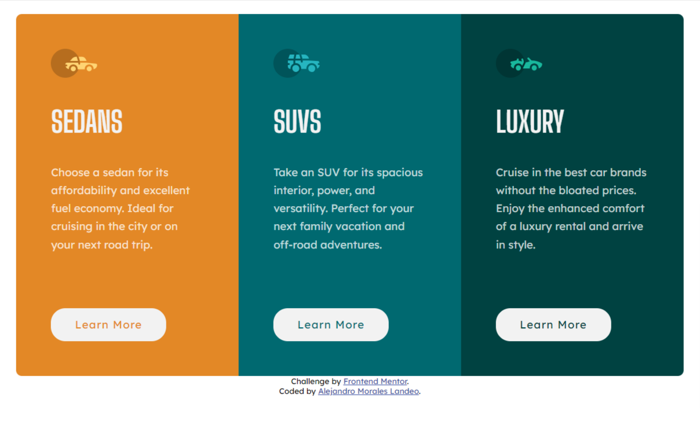
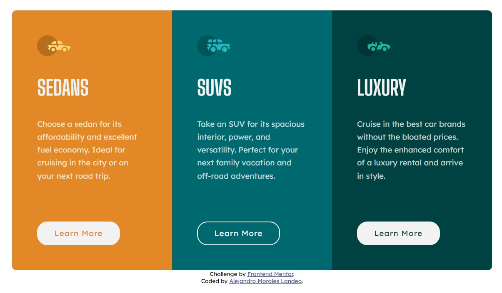

# Frontend Mentor - 3-column preview card component solution

This is a solution to the [3-column preview card component challenge on Frontend Mentor](https://www.frontendmentor.io/challenges/3column-preview-card-component-pH92eAR2-). Frontend Mentor challenges help you improve your coding skills by building realistic projects. 

## Table of contents

- [Overview](#overview)
  - [The challenge](#the-challenge)
  - [Screenshot](#screenshot)
  - [Links](#links)
- [My process](#my-process)
  - [Built with](#built-with)
  - [What I learned](#what-i-learned)
- [Author](#author)
- [Acknowledgments](#acknowledgments)


## Overview

### The challenge

Users should be able to:

- View the optimal layout depending on their device's screen size
- See hover states for interactive elements

### Screenshot
Desktop preview:


Desktop preview (with hover button):


Responsive:


### Links

- Solution URL: [Repository](https://github.com/amoraleslandeo/3-column-preview-card-component.github.io)
- Live Site URL: [Web page](https://amoraleslandeo.github.io/3-column-preview-card-component.github.io/)

## My process

### Built with

- Semantic HTML5 markup
- CSS custom properties
- Flexbox

### What I learned

I learned to force autoadjustment of the divs with this code:
```css
* {
    box-sizing: border-box;
}
```

Also learned how to handle the responsive design:
```html
  <meta name="viewport" content="width=device-width, initial-scale=1.0">
```

```css
@media (max-width: 375px) {
    main {
      height: auto;
    }
}
```

Also how to center the page vertically:
```css
html, body {
    height: 100%;
}
```
And how to center the content vertically:
```css
main {
    display: flex;
    flex-direction: column;
    justify-content: center;
    height: 100%;
}
```

## Author

- Website - [Alejandro Morales Landeo](https://amoraleslandeo.github.io/personal-page.github.io/)
- Frontend Mentor - [@amoraleslandeo](https://www.frontendmentor.io/profile/amoraleslandeo)


## Acknowledgments

I wanna say thanks to my daily support [Roberto](https://github.com/RobertoSilvaZ) 🙌😉 who has become my developer Mentor and guide through this process that is just beggining.

